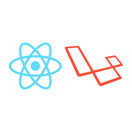

# Contacts Project



[](https://github.com/DevJoaoLopes/contact-web/issues)
[](https://github.com/DevJoaoLopes/contact-web/network)
[](https://github.com/DevJoaoLopes/contact-web/network)
[](https://github.com/DevJoaoLopes/contact-web/blob/master/LICENSE)

## Technologies used

- Laravel
- MySQL
- React JS
- Docker (Laradock)
- Send Mail

## Run project

- Follow commands: 

Clone project

```sh
    git clone https://github.com/DevJoaoLopes/contact-web.git
```

```sh
    cd contact-web/
```

create a file called ```.env``` and copy the contents of ```.env.example``` into it
(**in the email part, put your data**)

clone docker for ```laradock```
```sh
    git clone https://github.com/laradock/laradock.git
```
inside the laradock folder create a file called ```.env``` and paste the code contained in ```.env.laradock``` which is at the root of the project


in folder ```laradock``` , run containers

**obs: this step will take a while(
have a coffee in the meantime rsrs)**

```sh
    cd laradock/
    sudo docker-compose up -d nginx mysql phpmyadmin
```
entrar no container
rodar composer install
rodar seed
rodar npm